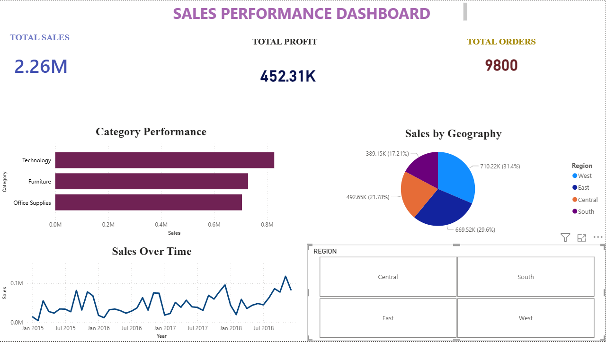

# Sales Performance Dashboard

This project analyzes sales data using Power BI.

## Key Insights:
- Total Sales, Profit, and Orders overview
- Sales distribution by category and region
- Sales trend over time

## Tools Used:
- Power BI
- Excel

## Outcome:
Created an interactive dashboard to help understand business performance.
